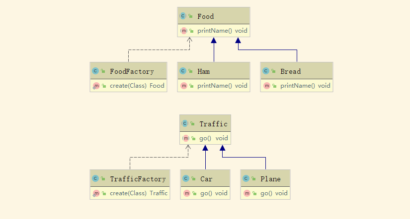
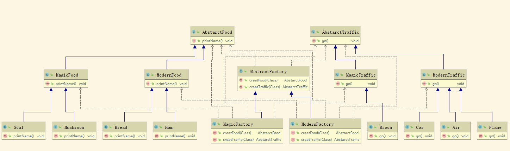

# 工厂模式
> 任何可以产生对象的方法或类，都可以称之为工厂

单例也是一种工厂

为什么有了new之后，还要有工厂？
 - 灵活控制生成过程
 - 权限、修饰、日志。

## 简单工厂 -> simple

### 类图

### 主方法
[简单主方法](./code/simple/Main.java)

## 抽象工厂  -> abs

### 类图

### 主方法
[简单主方法](./code/abs/Main.java)

