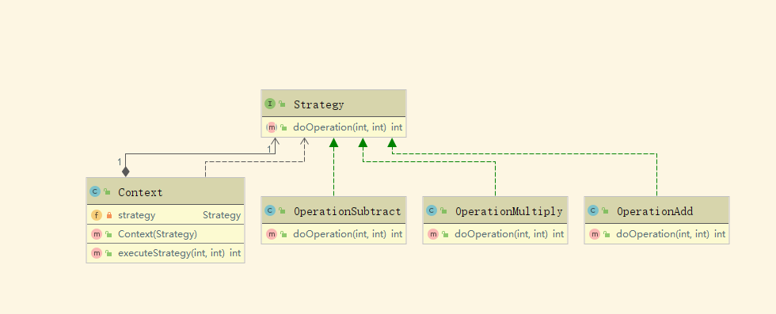

### 策略模式
> 定义一系列的算法,把它们一个个封装起来, 并且使它们可相互替换。 

例子：商场结算规则（1.满减 2.积分 3.折扣）

创建结算策略接口
分别创建正常收费、满减策略、折扣策略实现策略接口
创建中心类，根据实行规则实例化相关策略对象
调用中心策略计算方法

### 类图

### 主方法
[主方法](./code/Main.java)

> 使用实例 ：Comparator 接口相关实现 